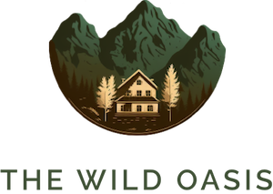
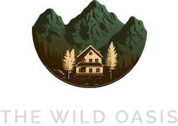

# The Wild Oasis

<p align="center">
	
</p>

<p align="center">
	A hotel operations dashboard for managing cabins, bookings, guests, check-ins, and daily business activity from one place.
</p>

<p align="center">
	
	
	
	
</p>

## What It Does

The Wild Oasis is built for hotel staff who need a fast, focused control panel for day-to-day operations. It combines guest management, booking workflows, cabin administration, account settings, and business insights in a single interface.

## Highlights

- Secure authentication with protected routes
- Dashboard with business metrics and charts
- Cabin management with create, update, and delete flows
- Booking detail views and booking operations
- Guest records and supporting workflows
- Check-in and check-out actions for current stays
- Account updates, app settings, and dark mode support

## Tech Stack

- React 19
- TypeScript
- Vite
- TanStack React Query
- Supabase
- styled-components
- React Hook Form
- React Router
- Recharts

## Project Structure

The codebase is organized by feature so each product area stays easy to understand and maintain.

| Path           | Purpose                                                                                          |
| -------------- | ------------------------------------------------------------------------------------------------ |
| `src/features` | Domain logic for cabins, bookings, guests, dashboard, authentication, settings, and check-in/out |
| `src/pages`    | Route-level screens                                                                              |
| `src/services` | API, React Query, and Supabase integration                                                       |
| `src/ui`       | Reusable UI building blocks                                                                      |
| `src/hooks`    | Shared custom hooks                                                                              |
| `src/context`  | App-wide context providers                                                                       |

## Getting Started

1. Install dependencies.

```bash
npm install
```

2. Start the development server.

```bash
npm run dev
```

3. Open http://localhost:4000 in your browser.

## Available Scripts

| Script            | Description                                      |
| ----------------- | ------------------------------------------------ |
| `npm run dev`     | Start the Vite development server on port `4000` |
| `npm run build`   | Type-check and create a production build         |
| `npm run preview` | Preview the production build locally             |
| `npm run lint`    | Run ESLint across the project                    |
| `npm run test`    | Run the Vitest test suite                        |

## Implementation Notes

- Supabase is wired through `src/services/supabase.ts`.
- React Query Devtools are enabled in development.
- Route protection, toasts, and global styles are already configured in the app shell.
- The repository includes light and dark logo assets in `public/` for branding.

## Visual Identity

<p align="center">
	
	
</p>
